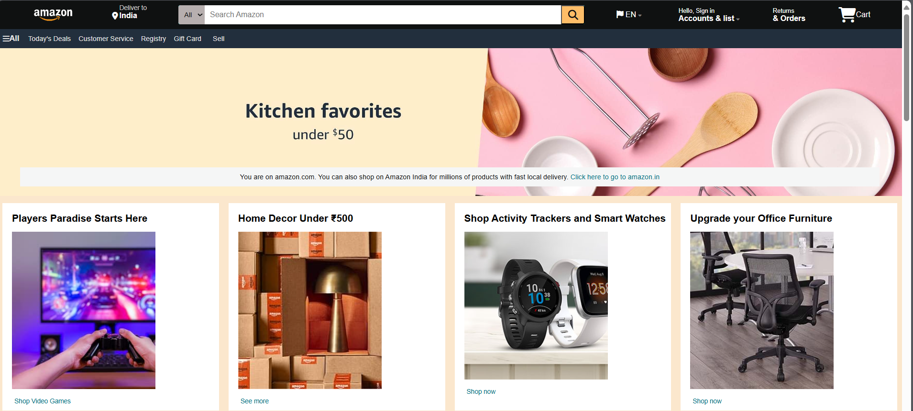
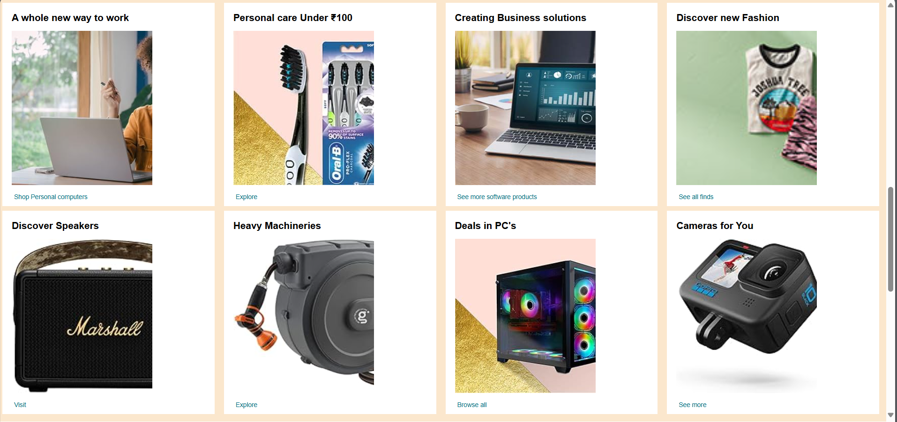
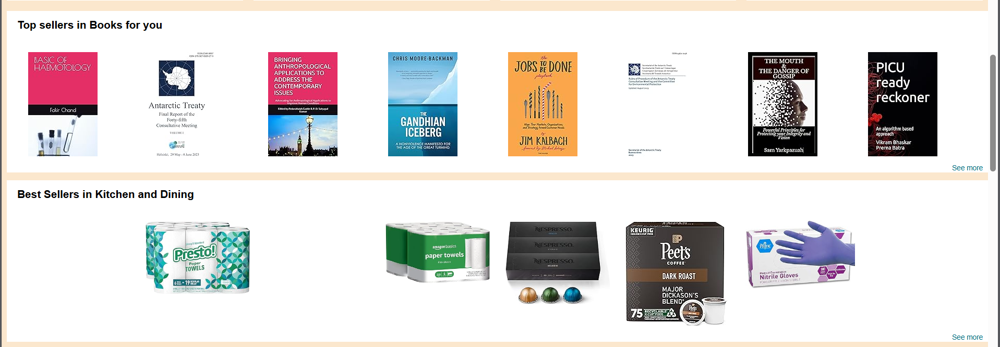
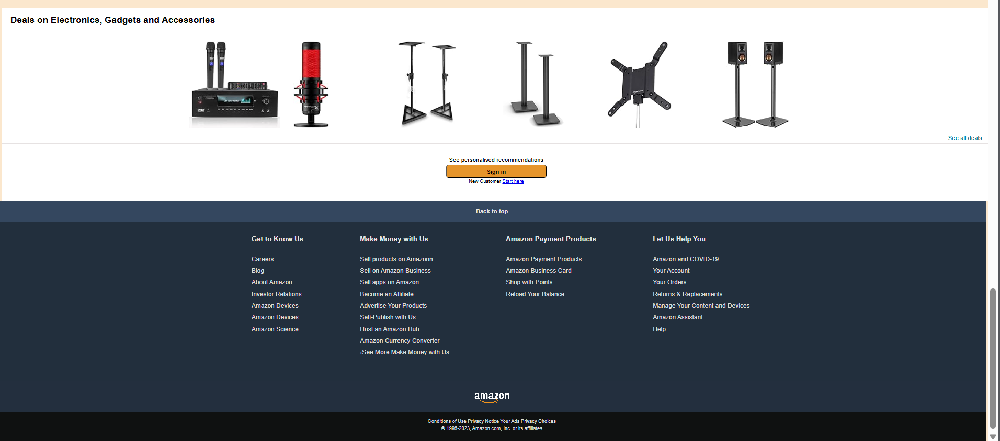

# Amazon.in Clone Project

## Table of Contents

- Features
- Technologies Used
- Usage
- File Structure
- Screenshots
- Contributing

## Features

- **Navigation Bar**: Includes logo, search box, and account options.
- **Product Listings**: Displays various products with images, descriptions, and prices.
- **Responsive Design**: Adjusts to different screen sizes for optimal viewing.
- **Footer**: Contains links to various sections of the site.

## Technologies Used

- **HTML**: For structuring the website.
- **CSS**: For styling the website (linked as `amastyle.css`).

## Usage

## How to Use

1. **Clone the repository**:
    ```bash
    git clone --no-checkout https://github.com/sohan10012/HTML-CSS-JS.git
    ```
2. **Navigate to the project directory**:
    ```bash
    cd HTML-CSS-JS
    ```
3. **Initialize sparse-checkout**:
    ```bash
    git sparse-checkout init --cone
    ```
4. **Set the folder you want to clone**:
    ```bash
    git sparse-checkout set "Amazon-code"
    ```
5. **Checkout the files**:
    ```bash
    git checkout
    ```
6. **Open `amazon.html` in your browser** to view the form.


## File Structure

- `amazon.html`: The main HTML file for the Amazon.in clone.
- `amastyle.css`: The CSS file for styling the website.


## Screenshots






## Contributing

If you would like to contribute to this project, please fork the repository and submit a pull request. For major changes, please open an issue first to discuss what you would like to change.

