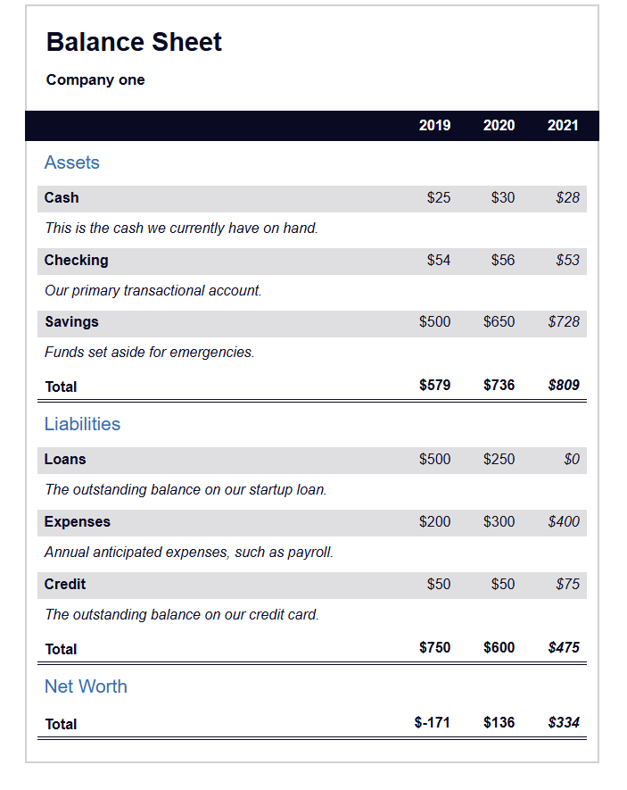

# Balance Sheet Project

## Table of Contents

- Features
- Technologies Used
- Usage
- File Structure
- Screenshots
- Contributing

## Features

- **Balance Sheet Display**: Shows assets, liabilities, and net worth for the years 2019, 2020, and 2021.
- **Detailed Descriptions**: Each item includes a description for better understanding.
- **Responsive Design**: Adjusts to different screen sizes for optimal viewing.

## Technologies Used

- **HTML**: For structuring the balance sheet.
- **CSS**: For styling the balance sheet (linked as `balancesheet.css`).

## How to Use

1. **Clone the repository**:
    ```bash
    git clone --no-checkout https://github.com/sohan10012/HTML-CSS-JS.git
    ```
2. **Navigate to the project directory**:
    ```bash
    cd HTML-CSS-JS
    ```
3. **Initialize sparse-checkout**:
    ```bash
    git sparse-checkout init --cone
    ```
4. **Set the folder you want to clone**:
    ```bash
    git sparse-checkout set "Balance Sheet"
    ```
5. **Checkout the files**:
    ```bash
    git checkout
    ```
6. **Open `index.html` in your browser** to view the form.

## File Structure

- `index.html`: The main HTML file for the balance sheet.
- `balancesheet.css`: The CSS file for styling the balance sheet.

## Screenshots



## Contributing

If you would like to contribute to this project, please fork the repository and submit a pull request. For major changes, please open an issue first to discuss what you would like to change.

