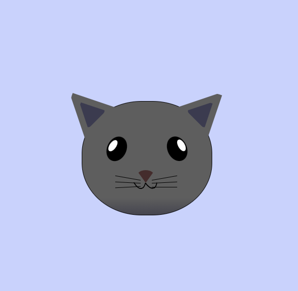

# Cat Painting Project

## Table of Contents

- Features
- Technologies Used
- Usage
- File Structure
- Screenshots
- Contributing

## Features

- **Cat Head Design**: Includes detailed elements such as ears, eyes, nose, mouth, and whiskers.
- **CSS Styling**: Uses CSS for detailed styling of the cat's features.

## Technologies Used

- **HTML**: For structuring the cat painting.
- **CSS**: For styling the cat painting (linked as `design.css`).

## How to Use

1. **Clone the repository**:
    ```bash
    git clone --no-checkout https://github.com/sohan10012/HTML-CSS-JS.git
    ```
2. **Navigate to the project directory**:
    ```bash
    cd HTML-CSS-JS
    ```
3. **Initialize sparse-checkout**:
    ```bash
    git sparse-checkout init --cone
    ```
4. **Set the folder you want to clone**:
    ```bash
    git sparse-checkout set "Cat"
    ```
5. **Checkout the files**:
    ```bash
    git checkout
    ```
6. **Open `index.html` in your browser** to view the form.

## File Structure

- `index.html`: The main HTML file for the cat painting.
- `design.css`: The CSS file for styling the cat painting.

## Screenshots



## Contributing

If you would like to contribute to this project, please fork the repository and submit a pull request. For major changes, please open an issue first to discuss what you would like to change.

Feel free to customize this template further to fit your project's specific needs!
