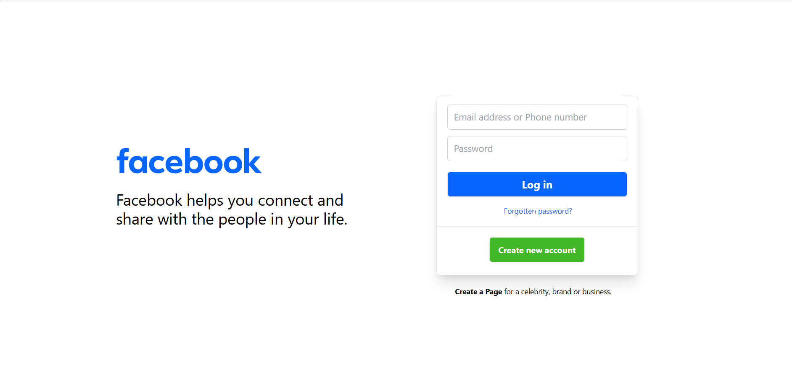
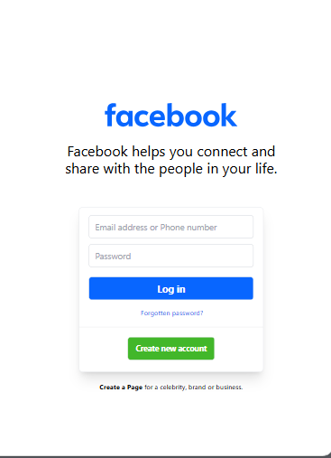
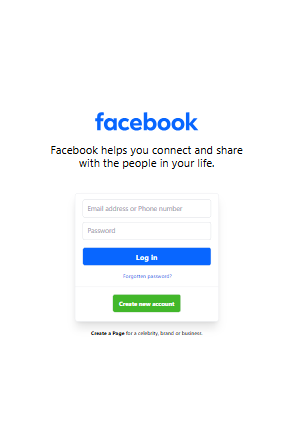

# Facebook Clone Project

## Table of Contents

- Features
- Technologies Used
- Usage
- File Structure
- Screenshots
- Contributing

## Features

- **Responsive Design**: Adjusts to different screen sizes for optimal viewing, including Surface 7 Pro, Surface Duo, Samsung Galaxy S8, laptops, and desktops.
- **Tailwind CSS**: Utilizes Tailwind CSS for styling.
- **Vite**: Built using Vite for fast development and optimized build.

## Technologies Used

- **HTML**: For structuring the project.
- **Tailwind CSS**: For styling the project.
- **Vite**: For building and running the project.
- **Node.js**: Required for running the development server and building the project.

## How to Use

1. **Clone the repository**:
    ```bash
    git clone https://github.com/yourusername/facebook-clone.git
    ```
2. **Navigate to the project directory**:
    ```bash
    cd facebook-clone
    ```
3. **Install dependencies**:
    ```bash
    npm install
    ```
4. **Run the development server**:
    ```bash
    npm run dev
    ```
5. **Build the project for production**:
    ```bash
    npm run build
    ```
6. **Preview the production build**:
    ```bash
    npm run preview
    ```
7. **Open `index.html` in your browser** to view the project.

## File Structure

- `index.html`: The main HTML file for the project.
- `style.css`: The CSS file for styling the project.
- `vite.config.js`: Vite configuration file.
- `src/`: Source directory containing JavaScript and other assets.

## Screenshots

**RESPOSIVENESS SCREENSHOT**
<div align="center">
    
     
     
</div>

## Contributing

If you would like to contribute to this project, please fork the repository and submit a pull request. For major changes, please open an issue first to discuss what you would like to change.
