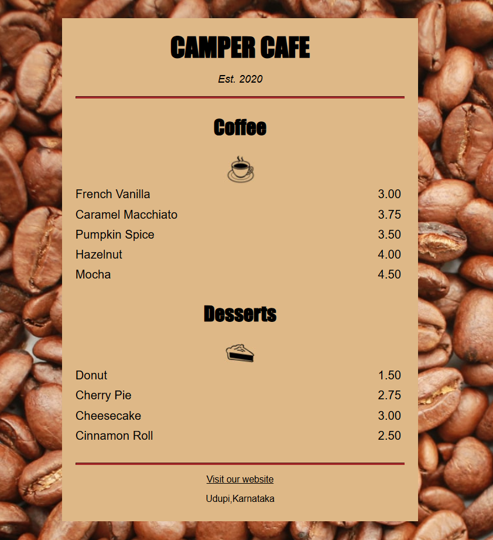

```markdown
# Cafe Menu Project

## Table of Contents

- Features
- Technologies Used
- Usage
- File Structure
- Screenshots
- Contributing

## Features

- **Coffee Menu**: Lists various coffee options with prices.
- **Desserts Menu**: Lists various dessert options with prices.
- **Establishment Information**: Displays the establishment year of the cafe.

## Technologies Used

- **HTML**: For structuring the menu.
- **CSS**: For styling the menu (linked as `menu.css`).

## Usage

1. **Clone the repository**:
    ```bash
    git clone https://github.com/yourusername/cafe-menu.git
    ```
2. **Navigate to the project directory**:
    ```bash
    cd cafe-menu
    ```
3. **Open `index.html` in your browser** to view the menu.

## File Structure

- `index.html`: The main HTML file for the cafe menu.
- `menu.css`: The CSS file for styling the menu.

## Screenshots



## Contributing

If you would like to contribute to this project, please fork the repository and submit a pull request. For major changes, please open an issue first to discuss what you would like to change.

Feel free to customize this template further to fit your project's specific needs!
```

