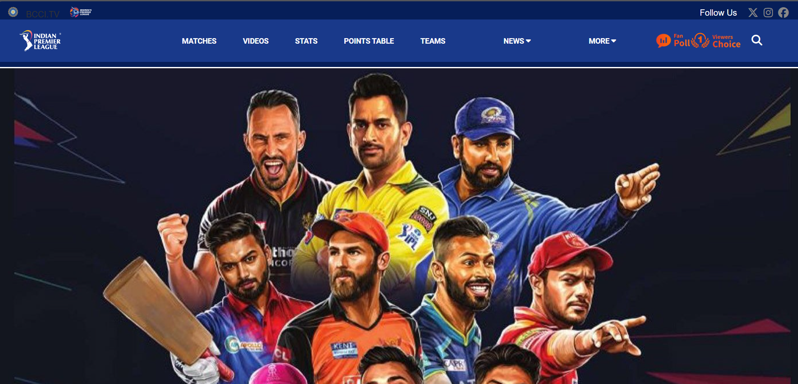
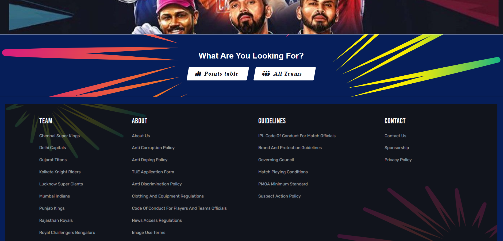

# IPL Website Clone Project

## Table of Contents

- Features
- Technologies Used
- Usage
- File Structure
- Screenshots
- Contributing

## Features

- **Live Scores**: Displays live scores of IPL matches.
- **Player Profiles**: Detailed profiles of IPL players.
- **Team Information**: Information about IPL teams.
- **Responsive Design**: Adjusts to different screen sizes for optimal viewing.

## Technologies Used

- **HTML**: For structuring the website.
- **CSS**: For styling the website (linked as `style.css`).
- **JavaScript**: For adding interactivity (linked as `script.js`).

## Project Description

This IPL website clone project was created for a competition. The goal was to replicate the original IPL website as closely as possible. Every element, from the layout to the color scheme, was meticulously designed to resemble the original site. We aimed to capture the essence of the IPL website, ensuring that the clone looks and feels like the real thing and this is what we came up with in a 3hr timed competition .

## How to Use

1. **Clone the repository**:
    ```bash
    git clone --no-checkout https://github.com/sohan10012/HTML-CSS-JS.git
    ```
2. **Navigate to the project directory**:
    ```bash
    cd IPL-Website-Clone
    ```
3. **Initialize sparse-checkout**:
   ```bash
    git sparse-checkout init --cone
    ```
4. **Set the folder you want to clone**:
   ```bash
    git sparse-checkout set "IPL-Website-Clone"
    ```  
5. **Checkout the files**:
   ```bash
    git checkout
    ```    
6. **Open `index.html` in your browser** to view the website.

## File Structure

- `index.html`: The main HTML file for the website.
- `style.css`: The CSS file for styling the website.
- `script.js`: The JavaScript file for adding interactivity.

## Screenshots




## Contributing

If you would like to contribute to this project, please fork the repository and submit a pull request. For major changes, please open an issue first to discuss what you would like to change.
