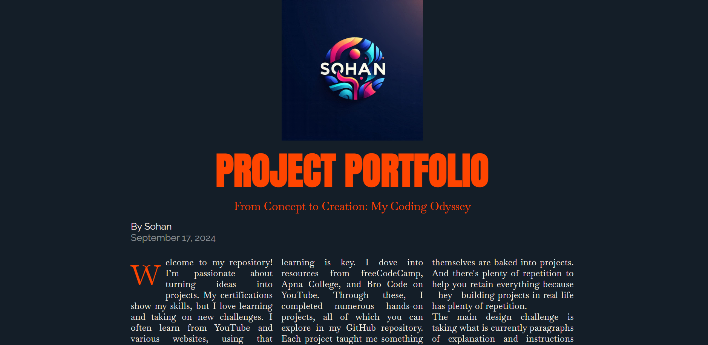
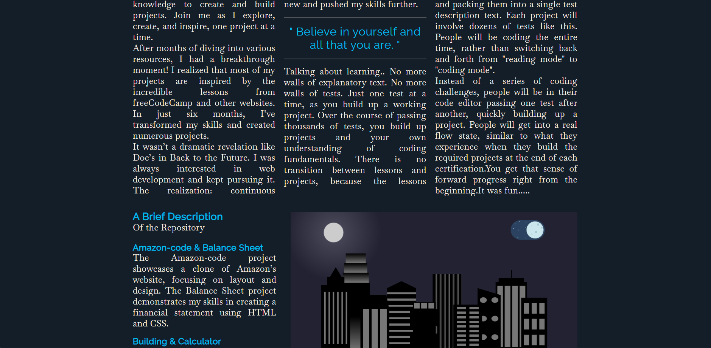
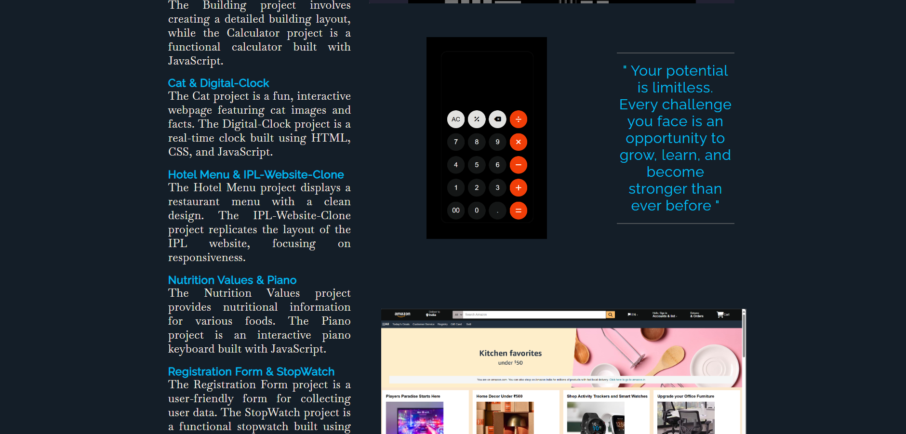
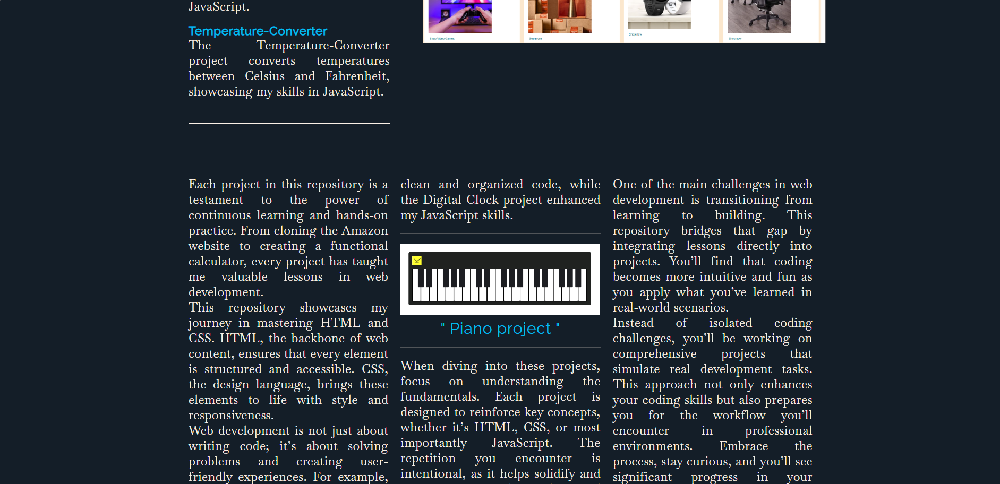
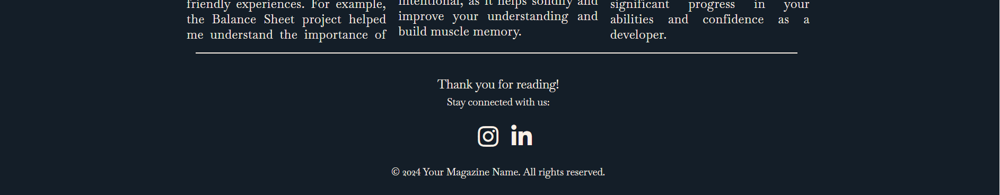

# Magazine Project

## Table of Contents

- Features
- Technologies Used
- Usage
- File Structure
- Screenshots
- Contributing

## Features

- **Engaging Content**: Displays articles, images, and other multimedia content.
- **Responsive Design**: Adjusts to different screen sizes for optimal viewing.
- **Stylish Footer**: Includes social media links and copyright information.

## Technologies Used

- **HTML**: For structuring the magazine content.
- **CSS**: For styling the magazine (linked as `styles.css`).

## How to Use

1. **Clone the repository**:
    ```bash
    git clone --no-checkout https://github.com/sohan10012/HTML-CSS-JS.git
    ```
2. **Navigate to the project directory**:
    ```bash
    cd Magazine
    ```
3. **Initialize sparse-checkout**:
   ```bash
    git sparse-checkout init --cone
    ```
4. **Set the folder you want to clone**:
   ```bash
    git sparse-checkout set "Magazine"
    ```  
5. **Checkout the files**:
   ```bash
    git checkout
    ```    
6. **Open `index.html` in your browser** to view the magazine.

## File Structure

- `index.html`: The main HTML file for the magazine.
- `styles.css`: The CSS file for styling the magazine.

## Screenshots







## Contributing

If you would like to contribute to this project, please fork the repository and submit a pull request. For major changes, please open an issue first to discuss what you would like to change.
