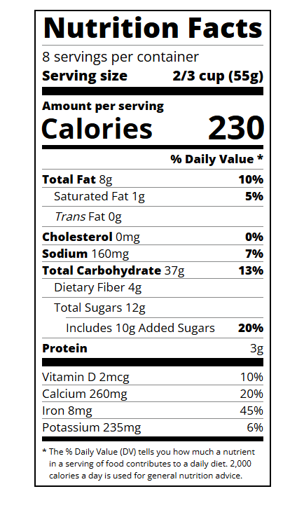

# Nutrition Facts Label Project

## Table of Contents

- Features
- Technologies Used
- Usage
- File Structure
- Screenshot
- Contributing

## Features

- **Responsive Design**: Adjusts to different screen sizes for optimal viewing on any device.
- **Detailed Information**: Includes serving size, calories, and breakdown of nutrients.
- **Clean Layout**: Easy-to-read format with clear sections for each nutrient.

## Technologies Used

- **HTML**: For structuring the label and its elements.
- **CSS**: For styling the label.

## Usage

1. **Clone the repository**:
    ```bash
    git clone --no-checkout https://github.com/sohan10012/HTML-CSS-JS.git
    ```
2. **Navigate to the project directory**:
    ```bash
    cd HTML-CSS-JS
    ```
3. **Initialize sparse-checkout**:
   ```bash
    git sparse-checkout init --cone
    ```
4. **Set the folder you want to clone**:
   ```bash
    git sparse-checkout set "Nutrition values"
    ```  
5. **Checkout the files**:
   ```bash
    git checkout
    ```    
6. **Open `nutrition.html` in your browser** to view the form.

## File Structure

- `nutrition.html`: The main HTML file containing the Nutrition Facts label.
- `nutrition.css`: The CSS file for styling the label.

## Screenshot



## Contributing

If you would like to contribute to this project, please fork the repository and submit a pull request. For major changes, please open an issue first to discuss what you would like to change.
