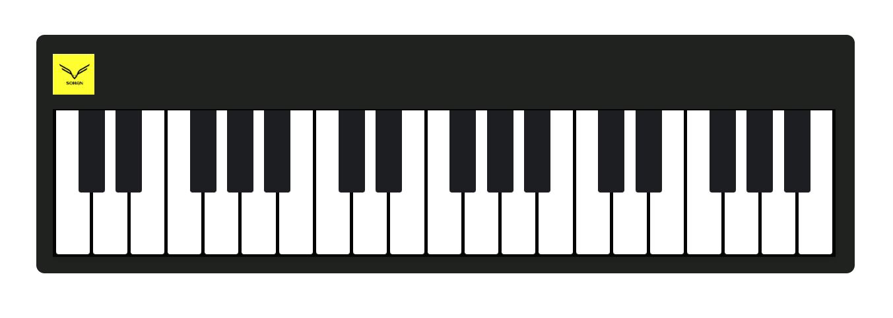

# 🎹 **Piano Web Application**

This repository contains the code for a web application that simulates a piano with interactive keys.

## 📝 **Description**

The web application is built using **HTML**, **CSS**, and **JavaScript**. It provides a user-friendly interface where users can click on piano keys to simulate playing a piano.

## 💻 **Languages Used**

- **HTML**: Used for structuring the web page.
- **CSS**: Used for styling the web page.
- **JavaScript**: Used for adding functionality to the web page.

## How to Use

## Usage

1. **Clone the repository**:
    ```bash
    git clone --no-checkout https://github.com/sohan10012/HTML-CSS-JS.git
    ```
2. **Navigate to the project directory**:
    ```bash
    cd HTML-CSS-JS
    ```
3. **Initialize sparse-checkout**:
   ```bash
    git sparse-checkout init --cone
    ```
4. **Set the folder you want to clone**:
   ```bash
    git sparse-checkout set "Piano"
    ```  
5. **Checkout the files**:
   ```bash
    git checkout
    ```    
6. **Open `index.html` in your browser** to view the piano.

## Screenshots



## Contributing

Feel free to contribute to this project by submitting issues or pull requests. Let's make this piano application even better together!
