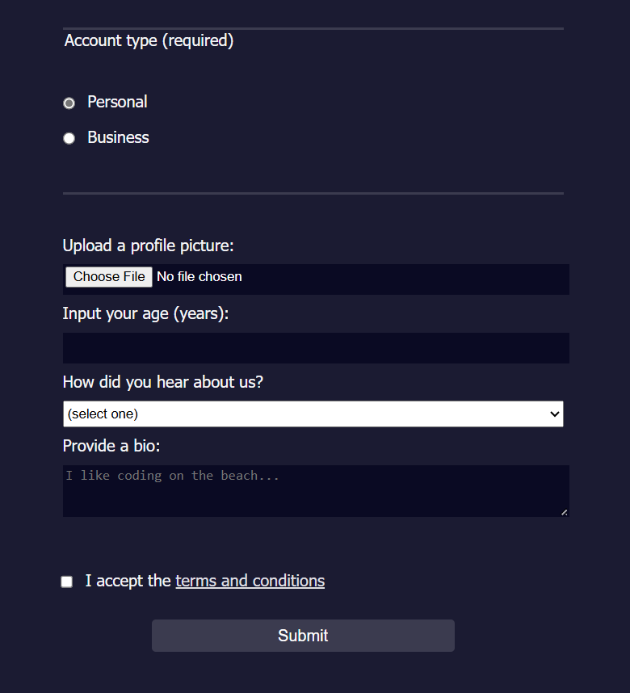

# Registration Form

## Table of Contents

- Features
- Technologies Used
- Usage
- File Structure
- Screenshot
- Contributing

## Features

- User Input Fields: Collects first name, last name, email, and password.
- Account Type Selection: Users can choose between a personal or business account.
- Profile Picture Upload: Allows users to upload a profile picture.
- Age Input: Users can enter their age, with validation to ensure it is between 13 and 120 years.
- Referral Source Dropdown: Users can specify how they heard about the service.
- Bio Text Area: Users can provide a brief bio.
- Terms and Conditions: Includes a checkbox for users to accept the terms and conditions.

## Technologies Used

- **HTML**: For structuring the form and its elements.
- **CSS**: For styling the form (linked as `registration.css`).
- **JavaScript**: For any client-side validation or interactivity (linked as `registration.js`).

## Usage

## Usage

1. **Clone the repository**:
    ```bash
    git clone --no-checkout https://github.com/sohan10012/HTML-CSS-JS.git
    ```
2. **Navigate to the project directory**:
    ```bash
    cd HTML-CSS-JS
    ```
3. **Initialize sparse-checkout**:
   ```bash
    git sparse-checkout init --cone
    ```
4. **Set the folder you want to clone**:
   ```bash
    git sparse-checkout set "Registration form"
    ```  
5. **Checkout the files**:
   ```bash
    git checkout
    ```    
3. **Open `index.html` in your browser** to view the form.

## File Structure

- `index.html`: The main HTML file containing the registration form.
- `registration.css`: The CSS file for styling the form.
- `registration.js`: The JavaScript file for client-side functionality.
  
## Screenshots




## Contributing

If you would like to contribute to this project, please fork the repository and submit a pull request. For major changes, please open an issue first to discuss what you would like to change.


