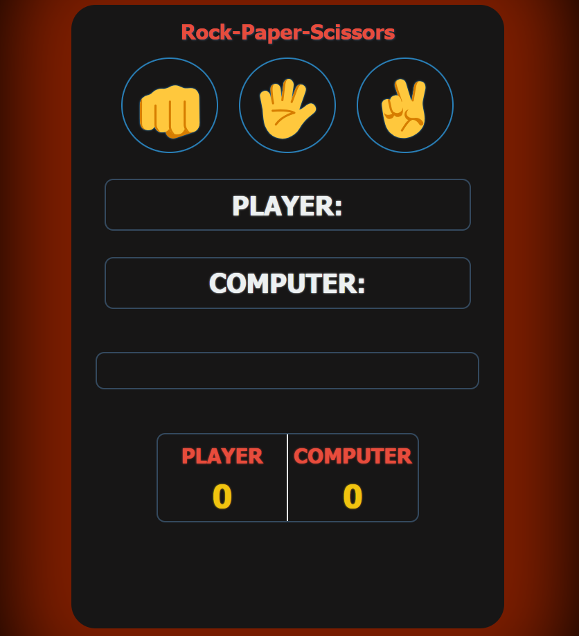

# Rock-Paper-Scissors Game

## Table of Contents

- Features
- Technologies Used
- Usage
- File Structure
- Screenshots
- Contributing

## Features

- **Interactive Gameplay**: Play Rock-Paper-Scissors against the computer.
- **Responsive Design**: Adjusts to different screen sizes for optimal viewing.
- **Modern UI**: Clean and modern user interface with dark colors and gradients.

## Technologies Used

- **HTML**: For structuring the project.
- **CSS**: For styling the project (linked as `styles.css`).
- **JavaScript**: For adding interactivity (linked as `java.js`).

## How to Use

1. **Clone the repository**:
    ```bash
    git clone --no-checkout https://github.com/sohan10012/HTML-CSS-JS.git
    ```
2. **Navigate to the project directory**:
    ```bash
    cd Rock-Paper-Scissors
    ```
3. **Open `index.html` in your browser** to view the project.

## File Structure

- `index.html`: The main HTML file for the project.
- `styles.css`: The CSS file for styling the project.
- `java.js`: The JavaScript file for adding interactivity.

## Screenshots



## Contributing

If you would like to contribute to this project, please fork the repository and submit a pull request. For major changes, please open an issue first to discuss what you would like to change.
