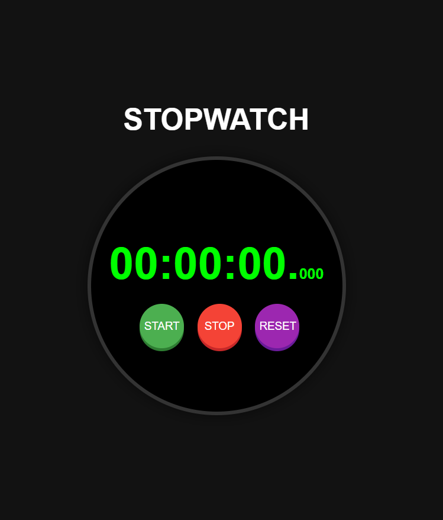

---

# ⏱️ Stopwatch Project

Welcome to the Stopwatch Project! This project is a simple yet functional stopwatch built using HTML, CSS, and JavaScript. It allows you to start, stop, and reset the timer with a sleek and professional design.

## Features

- **Start**: Begin timing from zero.
- **Stop**: Pause the timer at the current time.
- **Reset**: Reset the timer back to zero.
- **Real-Time Display**: Shows hours, minutes, seconds, and milliseconds.

## Languages Used

- **HTML**: Structure of the stopwatch.
- **CSS**: Styling for a professional and realistic look.
- **JavaScript**: Functionality to control the stopwatch.

## How to Use

1. **Clone the Repository**:
   ```bash
   git clone https://github.com/your-username/stopwatch-project.git
   cd stopwatch-project
   ```

2. **Open the `index.html` File**:
   - Simply open the `index.html` file in your web browser to start using the stopwatch.

## Screenshots



## Contributing

Feel free to contribute to this project by submitting issues or pull requests. Let's make this stopwatch even better together!


