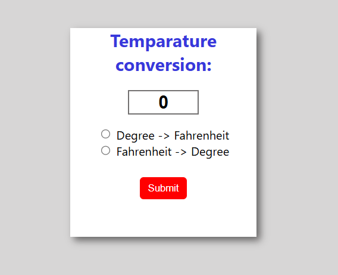

# ⏱️ Stopwatch Project

Welcome to the Stopwatch Project! This project is a simple yet functional stopwatch built using HTML, CSS, and JavaScript. It allows you to start, stop, and reset the timer with a sleek and professional design.

## Features

- **Start**: Begin timing from zero.
- **Stop**: Pause the timer at the current time.
- **Reset**: Reset the timer back to zero.
- **Real-Time Display**: Shows hours, minutes, seconds, and milliseconds.

## Languages Used

- **HTML**: Structure of the stopwatch.
- **CSS**: Styling for a professional and realistic look.
- **JavaScript**: Functionality to control the stopwatch.

## How to Use

1. **Clone the repository**:
    ```bash
    git clone --no-checkout https://github.com/sohan10012/HTML-CSS-JS.git
    ```
2. **Navigate to the project directory**:
    ```bash
    cd HTML-CSS-JS
    ```
3. **Initialize sparse-checkout**:
    ```bash
    git sparse-checkout init --cone
    ```
4. **Set the folder you want to clone**:
    ```bash
    git sparse-checkout set "Temperature-Converter"
    ```
5. **Checkout the files**:
    ```bash
    git checkout
    ```
6. **Open `index.html` in your browser** to view the form.

## Screenshots



## Contributing

Feel free to contribute to this project by submitting issues or pull requests. Let's make this stopwatch even better together!

